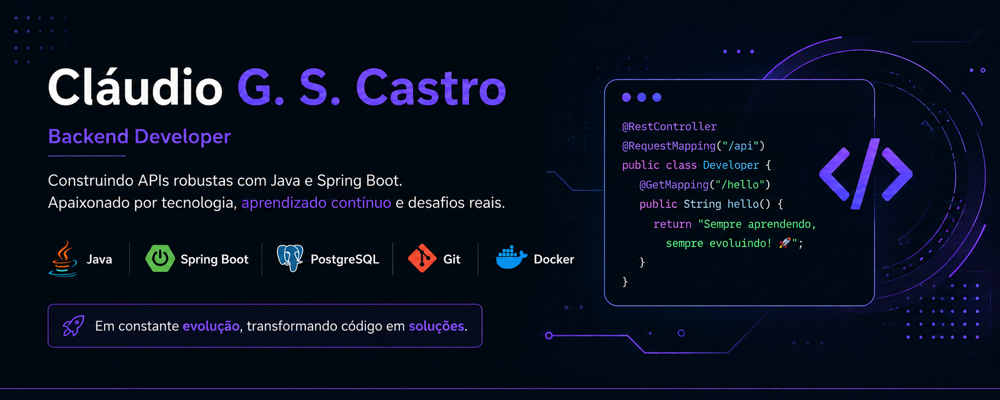

# Sobre mim.

Desenvolvedor Backend em formação com foco em Java e Spring Boot.
Atualmente construindo projetos práticos para aprofundar conhecimentos em APIs REST, bancos de dados relacionais e arquitetura backend.

### 💻 Tecnologias e Ferramentas

  

  
***

## Projetos 
| Projeto | Descrição | Tecs / Links |
| :--- | :--- | :--- |
|  **Banco Digital API** | API REST que simula operações bancárias reais, incluindo depósitos, saques, transferências e consulta de saldo. | [Ver Repositório](https://github.com/claudiodeveloper-github/banco-digital-api) |
|  **Gestao-Farmácia** | Sistema de gerenciamento de medicamentos em Java puro com conexão ao banco de dados MySQL, utilizando arquitetura em camadas e padrão DAO. | [Ver Repositório](https://github.com/claudiodeveloper-github/gestao-farmacia) |
|  **OS Manager** | Sistema completo de ordens de serviço com Spring Boot 3, Spring Security e Thymeleaf. | [Ver Repositório](https://github.com/claudiodeveloper-github/osmanager) |
|  **Desafio Itaú Backend** | API REST desenvolvida como desafio técnico. | [Ver Repositório](https://github.com/claudiodeveloper-github/desafio-itau-backend) |
|  **CRUD API Spring Boot** | API CRUD com Spring Boot e PostgreSQL. | [Ver Repositório](https://github.com/claudiodeveloper-github/crudapi-springboot) |
  
***

###  Projetos em Destaque

  
  

  
  

***

##  Foco de Desenvolvimento & Aprendizado

Com o objetivo de construir bases sólidas no desenvolvimento backend, concentro meus estudos diários no aprofundamento do ecossistema Java, buscando compreender as melhores práticas para entregar um código limpo e seguro. Atualmente, meus focos de estudo são:

  
  
  
  
  

 

### Conecte-se comigo!

Para vagas, parcerias ou apenas trocar uma ideia sobre código:

  
  

---
### Estatísticas do GitHub

  
  

 

  <h3>Foco e Conhecimento Técnico</h3>
  
Uma visão clara de onde concentro meu foco e habilidades práticas diariamente:

  
  
  
  

